## 机器学习第一次作业
### 题目：实现对图像的直方图均衡化以及灰度拉伸
<br/>  

##### 注：使用该程序时默认读取的是photo/lena.bmp 转换为灰度图后，源码当中读取的文件也要更改
##### 要重新编译的话进入build使用Cmake编译
<br>

### 一、算法描述
#### 1、直方图均衡化
<font size = 2><p style="text-indent:2em">直方图均衡化是指将原始图像的直方图转换为均匀分布的形式，手段是利用原始图像像素累计分布作为转换函数进行变换。</p>
$$P(i) = \frac{n_{i}}{n}, i = 1,2,...,255$$
再通过累加得到变换函数：$G(i)=\sum_{j=0}^{i}P(j)$，将原始像素经过这个函数变换后得到新的像素信息：
$index(i)=255G(i)$。  
映射关系为： 

$$pix(i)=index(pix(i))$$
</font>

#### 1、灰度拉伸
<font size = 2><p style="text-indent:2em">图像灰度拉伸是改变图像对比度的一种方法，通过灰度映射，将原图中某一区段中的灰度值映射到另一灰度值，从而拉伸或压缩整个图像的灰度分布范围。  
本次使用的是简单的线性拉伸：</p>

$$pix = 255 \frac{pix - min}{max - min} $$
</font>

### 二、程序流程图

```C
st=>start: 开始
op=>operation: 读取BMP文件
cond=>condition: Yes or No?
next=>operation: 转换成灰度图
nnext=>operation: 均衡化以及灰度拉伸
nnnext=>operation: 得到的新像素信息写回buffer
nnnnext=>operation: 写入BMP文件
e=>end
st->op->cond
cond(yes)->next
cond(no)->op
next->nnext->nnnext->nnnnext->e
```

### 三、处理结果
#### 1.C语言程序结果图
<center>原始图像</center>  

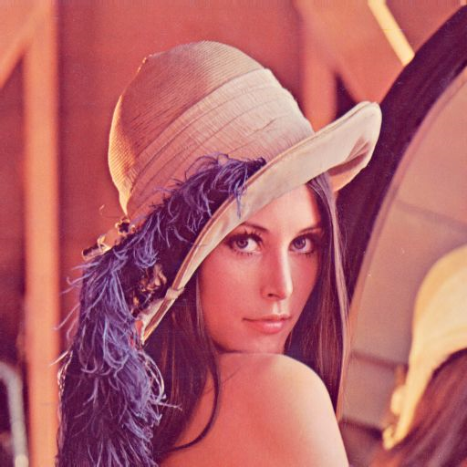

<center>灰度图</center>

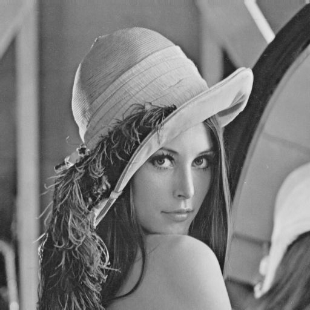

<table>
    <tr>
        <td ><center>图1  C均衡化</center></td>
        <td ><center>图2 OpenCV</center></td>
        <td ><center>图2 Matlibeq</center></td>
    </tr>

</table>

<table>
    <tr>
        <td ><center>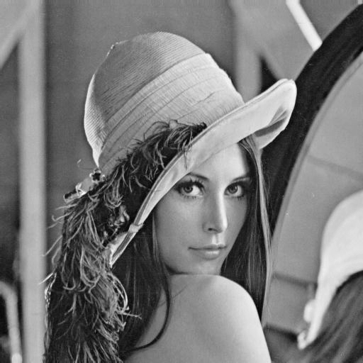图1  灰度拉伸</center></td>
        <td ><center>图2 Matlib</center></td>
    </tr>

</table>


### 四、对比

<font size = 2><p style="text-indent:2em">可以从转换过来的灰度图看出，图像整体偏灰，即对比度较低。通过C程序后亮部提高，暗部压暗，与OpenCV的equalieHist相比整体更加亮。这里Markdown的对比似乎有色差，单独打开文件进行比较，C、OpenCV和Matlib的效果基本相同，打开UltraEdit查看文件编码，似乎OpenCV将此图变成了8位色，而字节的代码与Matlib的处理则是保存24位，使用PS查看直方图，他们都不一样，但是显示相关基本相同。自编程序的时间复杂度为O(N^2)，不知道OpenCV的源码是什么样的，但是感觉写入BMP文件应该还是要一个一个像素写（时间复杂度应该相同），但是自己的代码最大的问题是只能处理BMP文件。（主要是解码BMP格式比较简单，没有压缩算法）</p>
<p style="text-indent:2em">灰度拉伸查OpenCV的文档似乎并没有现成的函数，只对自己的代码与Matlib的stretchlim和imadjust进行比较，自己的代码可以看出头发压暗，脸部更加立体，不过比较Matlib的效果差，Matlib并不是经行单纯的最大最小值拉伸，而是stretchlim选取‘by default,the limits specify the bottom 1% and the top 1% of all pixel values’，所以效果有差距。stretchlim可以给两个参数，第二个表示这个limit的取值。</p></font>

### 题目：实现sobel算子

### 一、算法描述
<font size = 2><p style="text-indent:2em">索贝尔算子是把图像中每个像素的八领域的灰度值加权差，在边缘处达到极值从而检测边缘。在扫描的时候可以添加padding，方便在边缘进行sobel算子操作，不过我选择直接忽略边缘1个像素。</p>
<p style="text-indent:2em">sobel算子如下：</p>

$$sobelx=
\begin{bmatrix}
  -1& 0 & 1\\
  -2& 0 & 2\\
  -1& 0 & 1
\end{bmatrix}
$$
$$sobely=
\begin{bmatrix}
  -1& -2 & -1\\
  0& 0 & 0\\
  1& 2 & 1
\end{bmatrix}
$$

$$pix = \sqrt{pix_{x}^{2} + pix_{y}^{2}}$$
<p style="text-indent:2em">把pix写回去就行。</p>

### 二、程序流程图

```flow 
st=>start: 开始
op=>operation: 读取BMP文件
cond=>condition: Yes or No?
next=>operation: 转换成灰度图
nnext=>operation: 对每个像素进行sobelx、sobely操作
nnnext=>operation: 得到的像素信息写会buffer
nnnnext=>operation: 写入BMP文件
e=>end
st->op->cond
cond(yes)->next
cond(no)->op
next->nnext->nnnext->nnnnext->e
```

### 三、处理结果
#### 1.C语言程序结果图
<table>
    <tr>
        <td ><center>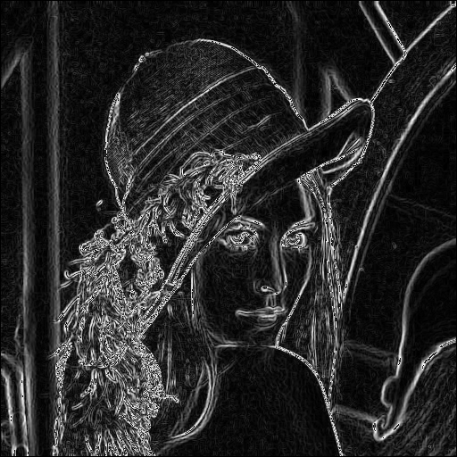图1  C边缘检测</center></td>
        <td ><center>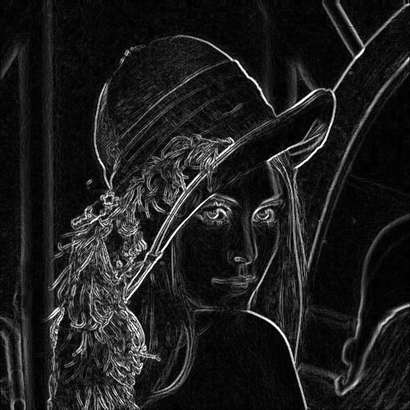图2 OpenCV</center></td>
        <td ><center>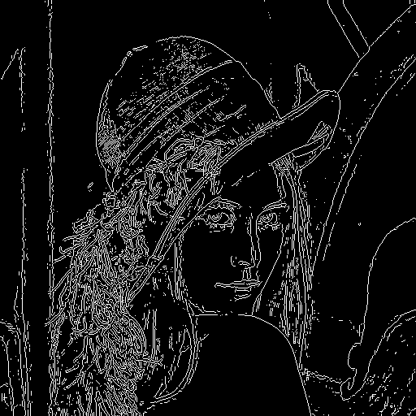图2 Matlib</center></td>
    </tr>
</table>

### 四、对比
<font size = 2><p style="text-indent:2em">对比三张图，都完成了边缘检测的任务，其中OpenCV边缘连续清晰，而Matlib自带的edge函数是将数据直接输出为2值[0,1]，相对来说一些不是很清晰的边界就会被过滤掉，比如左上的柱子。自编的代码效果还行名单时边缘线中间有很多暗条，猜测可能是我没有平滑直接就进行sobel操作的结果，不过OpenCV，我也是直接进行sobel操作的，看了文档sobel操作是不包含平滑操作的，这里自编代码的暗条就不是很能理解了。</p></font>

### 题目：高通、低通、带通滤波
### 一、算法描述
<font size = 2><p style="text-indent:2em">滤波器的原理是在图像的频域图中过滤掉特定的频率后再将频域信息转换为空间域，对于这个算法的实现难点在于得到频域图，本次使用的是常用的FFT算法通过递归蝶形运算（把奇次项和偶次项分组，得到2个n/2的FFT）的方式，把时间复杂度降低为O(nlogn)。
<font size = 2><p style="text-indent:2em">二维傅里叶变换的公式如下：（为了简单，xy维度相同）
$$ F(u,v) = \frac{1}{N}\sum_{n=0}^{N-1}\sum_{n=0}^{N-1}f(x,y)e^{-j\frac{2\pi}{N}(ux+vy)}, \quad u,v = 0,2,..,N-1$$
$$ f(x,y) = \frac{1}{N}\sum_{n=0}^{N-1}\sum_{n=0}^{N-1}F(u,v)e^{j\frac{2\pi}{N}(ux+vy)}, \quad x,y = 0,2,..,N-1$$
<font size = 2><p style="text-indent:2em">正变换出现$\frac{1}{N}$是为了保证像素点信息在[0,255]。
<font size = 2><p style="text-indent:2em">理想高通滤波：$F(u,v) = 0 \qquad D < D_{0}$，D为频域图中心与该点的距离。
<font size = 2><p style="text-indent:2em">巴特沃斯低通滤波器：$F(u,v) = F(u,v) * H(u,v)$，其中$H(u,v)= \frac{1}{1+(\frac{d}{d_{0}})^{2}}$。
<font size = 2><p style="text-indent:2em">高斯带通滤波器：$F(u,v) = F(u,v) * H(u,v)$，其中$H(u,v) = e^{-0.5 (\frac{(d^{2} - d_{0}^{2})}{d \omega})^{2}}$。

### 二、程序流程图

```flow
st=>start: 开始
op=>operation: 读取BMP文件
cond=>condition: Yes or No?
next=>operation: 转换成灰度图
nnext=>operation: 转换为频域图
op1=>operation: 滤波
nnnext=>operation: 得到的像素信息写会buffer
nnnnext=>operation: 写入BMP文件
e=>end
st->op->cond
cond(yes)->next
cond(no)->op
next->nnext->op1->nnnext->nnnnext->e
```

### 三、处理结果
#### 1.C语言程序结果图
<table>
    <tr>
        <td ><center>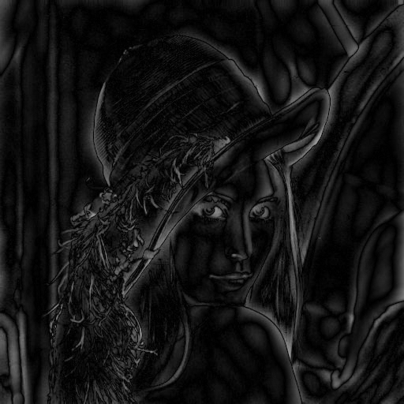图1  理想高通</center></td>
        <td ><center>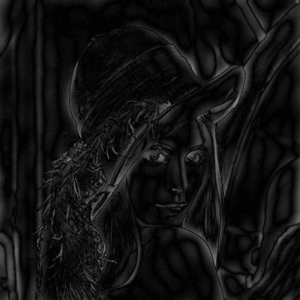图2 OpenCV</center></td>
        <td ><center>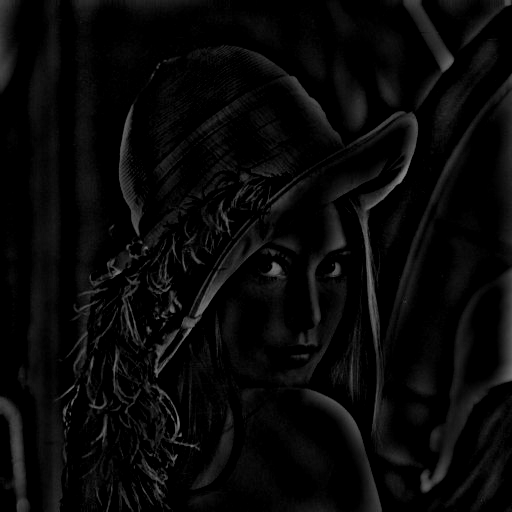图2 Matlib高通</center></td>
    </tr>
</table>
<table>
    <tr>
        <td ><center>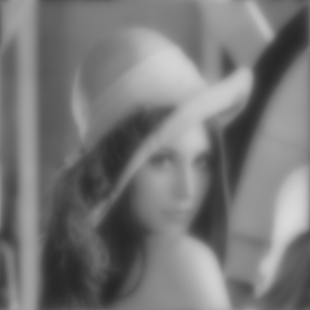图1  巴特沃斯低通</center></td>
        <td ><center>图2 OpenCV验证</center></td>
        <td ><center>图2 Matlib验证</center></td>
    </tr>
</table>
<table>
    <tr>
        <td ><center>图1  高斯带通</center></td>
        <td ><center>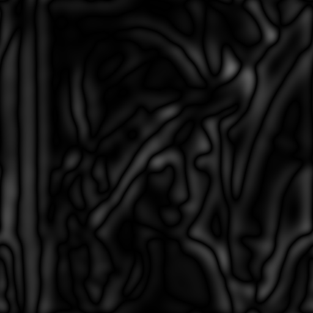图2 OpenCV验证</center></td>
        <td ><center>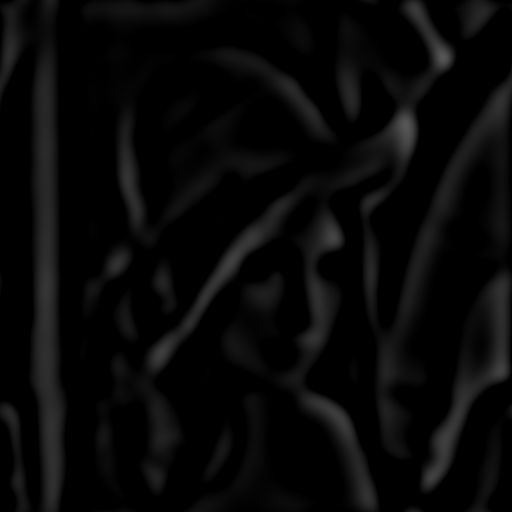图2 Matlib验证</center></td>
    </tr>
</table>

### 四、对比
<font size = 2><p style="text-indent:2em">对比三张图($d_{0}=10, \omega = 10)$，其中自己的代码与OpenCV相似，Matlib差距较大，我认为是Matlib存储图像的关系。这三个的主要验证自己的FFT变换，因为三种滤波函数都是有数学公式的。本次编写的主要问题是只支持高和宽都是$2^{N}$，这主要是由于FFT变换的需求，虽然可以补0来实现扩展，但是对于后续覆写BMP文件有一点问题，所以请使用高和宽都是$2^{N}$的图片，这个问题属于文件IO，不是本次重点，尝试解决无果后，打算强制使用高和宽都是$2^{N}$的图片。</p></font>
<br>

### 五、附件
#### BMP文件格式
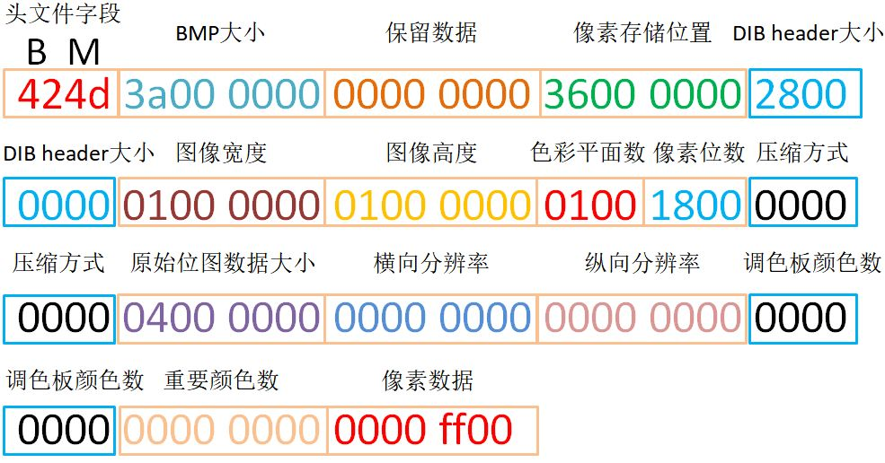